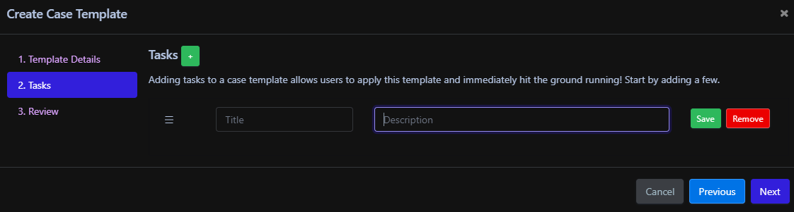
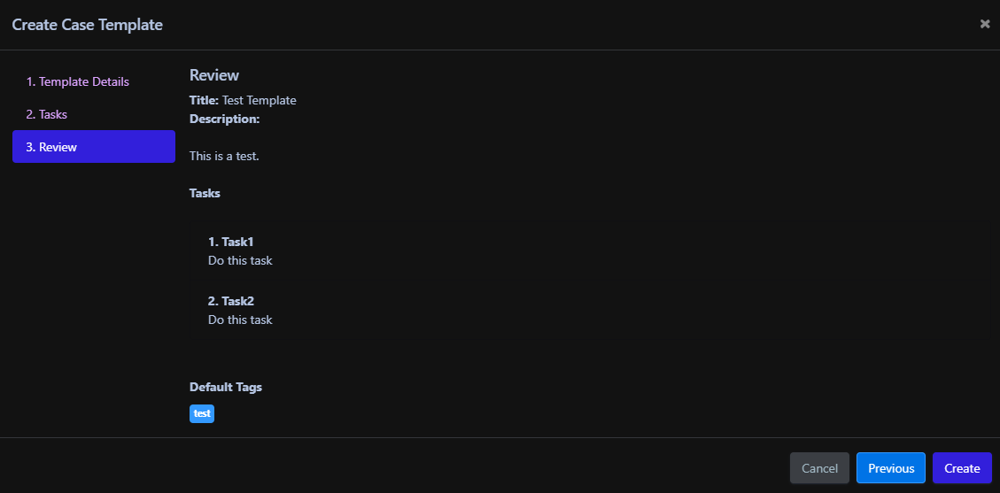

# Case Templates

Case Templates are a great way to provide structure to your investigations. It is a quick and easy method for making sure a case will conform to a defined process each time it is opened. 

To create a Case Template click on Cases from the left menu within Reflex and then click on Case Templates. This will bring up a list of all current Case Templates within Reflex.

Next click on New Case Template and the following Case Template Wizard will open. 

## Template Details

Select the Organization from the drop-down list. You may only have one option in the list unless you are leveraging the multitenancy function of Reflex.

Provide a Case Template Title as well as a brief description of the focus of the template. For example, Case Title - Phishing and Description - This can be used for investigating potential phishing events.

Next define the [Traffic Light Protocol ](https://www.cisa.gov/tlp) to define the sensitivity level of the information within the case.

Define the severity level you want associated with these types of cases.

Lastly, provide any additional tagging you would like to have for the template.

Click Next

## Tasks

As part of the case templates, tasks can be created for each step the analyst is suppose to complete as part of the investigation.

Click the + sign next to Tasks to add one to the case template. Add as many tasks to the Case Template by clicking the + sign again.

Enter a title for the Task as well as a description for what actions the analyst needs to complete. Then press Save.

You can edit a task by clicking the Edit button to the right of the task. Once finished making the changes press Save. 

Tasks can also be deleted from the template by pressing the Remove button to the right of each task.

Once you have added all tasks click Next.

## Review

The final step is to review the information provided to create the Case Template. 

If everything looks good press Create. 

## Editing/Deleting

At any time a Case Template can be modified or delete. Simply click Cases on the left hand menu and then click Case Templates.

Find the Case Template you want to modify or delete and select the apporiate action to the right of the Case Template.
