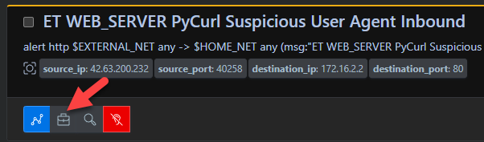
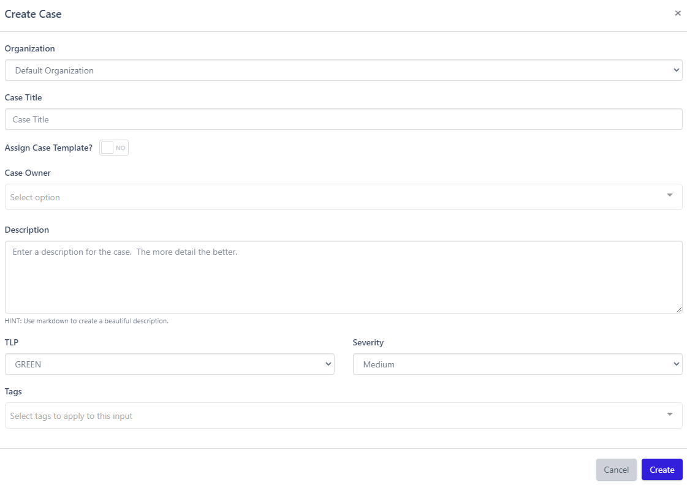

# Cases
A Case provides analyst the ability to group events together that may be linked to an [incident](https://csrc.nist.gov/glossary/term/incident). It also provides the ability for analysts to add notes, search event observables, create and track tasks, and provide a history of all actions related to the investigation. 

## Creating Cases
There are two ways to create a Case in Reflex:

### *From Event Card*
1. Navigate to the Events page
2. Select the relevant Event(s)
3. Click the brief case icon located in the bottom left of the Event card
4. Enter the necessary Case details
5. Click `Create`

### *From Cases Page*
1. Navigate to the Cases page
2. Click `New Case`
3. Enter the necessary Case details
4. Click `Create`

!!! note "Merging Events into a Case"
    This method requires you to merge the relevant Events into the case after its creation.

### *Merging Events into a Previously Created Case*
1. Navigate to the Events page
2. Select the relevant Event(s)
3. Click `# events`
4. Click `Merge into Case`
5. Search and select the appropriate Case
6. Click `Merge`

