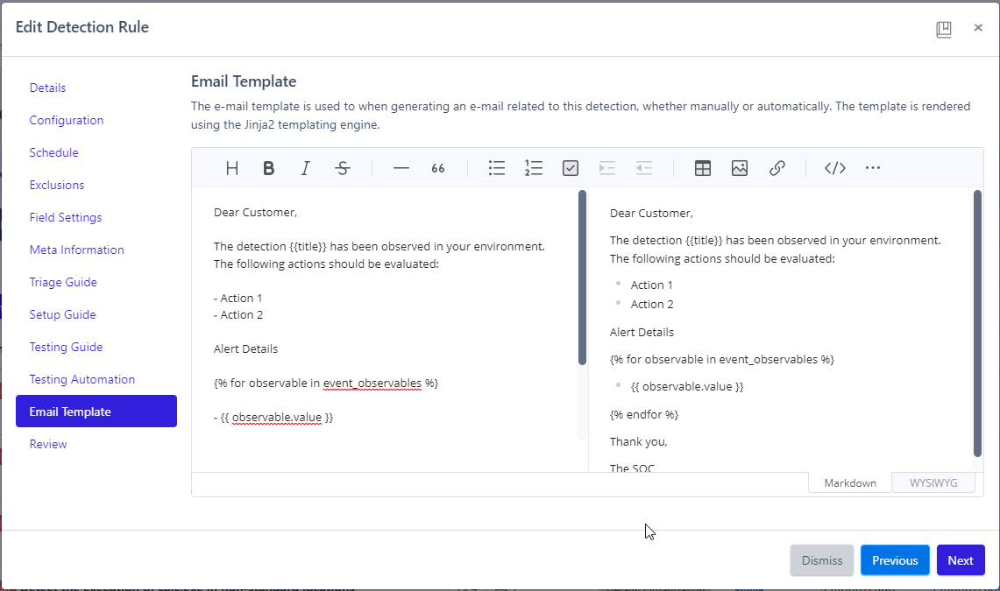

# Detections
**Detections**, or _Detection Rules_, are a collection of queries that look for particular behaviors in log sources/Inputs.

!!! note
    Detections cannot be configured until an Input is created (see [Inputs](../inputs/index.md) for detailed information on how to configure these).

## Creating Detections
To create new Detection Rules, the followings steps can be used:

1. Navigate to the Detections page
2. Click `New Detection`
3. Click `Next` after filling out the necessary information for each section
4. Once all settings have been configured, review the resulting query
5. Click `Create`

## Configuring Detections
There are several pieces of information required to create successful Detection Rules. The following italicized headers provide a detailed description of each section in the Detection Rule creation process.

### _Details_
   * **Import from Sigma?**: allows you to paste in previous Sigma queries and convert them to Reflex
   * **Organization**: the organization to apply the Rule to
   * **Name**: a relevant name to describe the Detection
   * **Description**: a brief description of what the Detection does (optional)
   * **Input**: what input the Detection Rule will use
   * **Tags**: relevant tags to apply to events triggered by the Rule

!!! warning "Always Document"
    Don't avoid this section. Do yourself a favor and document in detail the purpose of this Detection so you don't forget it.

### _Configuration_
* **Rule Status**: the state the Rule is in for easier identification
* **[Rule Type](rule-types.md)**: the type of Detection Rule
* **Severity**: determines the severity of the events the Rule with detect

!!! note "Severity"
    Changing the severity will automatically update the risk score; however, it can still be manually changed.

### _Schedule_
* **Run Interval**: how often the Detection will run in minutes

!!! note "Run Interval"
    The Run Interval will automatically adjust itself and the Lookbehind time if the Detection is ran late under any circumstance.

* **Lookbehind**: how far back the Detection should look in minutes

!!! note "Lookbehind"
    The Run Interval and Lookbehind should equal the same number of minutes to avoid overlap, which could result in duplicate events.

* **Mute Period**: how long in minutes all future hits of the Detection should be silenced
* **Daily Schedule**: specific days and hours to run Detection from

### _Exclusions_
* Define specific exclusions to prevent a Detection Rule from firing on very specific criteria

    * Click `New Exclusion` to add as many exclusions as required
    * Exclusions are subtenant-specific and enable you to effectively modify Detection Rules from a [Repository](repositories.md) without modifying the base query

### _Field Settings_
* **Signature Fields**: create unique signatures on this Detection that will stack duplicates into one card for easier identification
   * Click `Clone From Input` to automatically generate these signatures from the Input
* **[Field Templates](../field-templates/index.md)**: define fields used to map values to an Observable when consuming data from an Input or creating an Event from a Detection
* **Additional Fields**: individually provide any other additional relevant fields

### _Meta Information_
* **MITRE Tactics**: identify the specific MITRE ATT&CK Tactic(s) to tag to alerts of this Detection
* **MITRE Techniques**: identify the specific MITRE ATT&CK Technique(s) to tag to alerts of this Detection
* **References**: link additional resources to help analysts understand the Detection

!!! note "CVE References"
    Entering a CVE number as a reference will automatically pull the top five CVE reference URLs.

### _Triage Guide_
* Provide a guide for analysts to reference that will allow them to determine the legitimacy of the event and how/when to alert the subtenant

* **False Positives**: identify any false positives that can occur with the Detection to help analysts quickly Rule out false positive activity

### _Setup Guide_
* Provide a description to your subtenants of prerequisite data and configuration needed for this Detection Rule to be implemented

### _Testing Guide_
* Provide a description on how the Detection Rule can be tested to ensure it is functioning as expected

### _Testing Automation_
* Provide a test script (optional) to test the Detection automatically
* **Script Language**: chose from Python, PowerShell, Batch, and Bash scripting languages
* **Safe Script**: when enabled, this says that the script is safe to run automatically

!!! note
    See [Testing Automation](testing-automation.md) for more information about how to utilize automated testing with your Detections.

### _Email Template_
* Create an email template utilizing the Jinja2 templating engine that enables analysts to effectively inform subtenants about alerts related to this Detection

### _Review_
* The final step to creating a Detection Rule: review it then click `Create`.

## Leveraging Detections
See [Repositories](repositories.md) for how to leverage Detections effectively with your subtenants.
