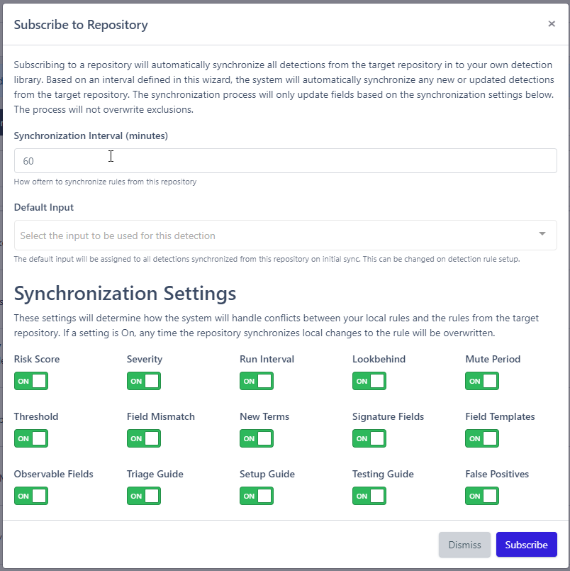

# Detection Repositories
Detection Repositories allow you to become a global tenant to share detection rules with your sub tenants. This means your customers won't have to manually create their own detection rules, and that any new detection rules you create will automatically be applied to the respective customer(s).

## Creating Detection Repositories
To create new Detection repositories, the followings steps can be used:

1. Navigate to the Detections page
2. Click `Detection Repositories`
3. Click `New Repository`
3. Click `Create` after filling out the necessary information

## Subscribing to a Repository
Subscribing to a Repository will automatically sync all Detections from the target Repository to your own Detection library. When subscribing to a Detection Repository, you can define a field called `Synchronization Interval (minutes)` which will determine how often you wish to synchronize new and updated Detections from the subscribed Repository.

!!! note
    Any local changes that have been made to the Detection Repository will be overwritten during synchronization.

However, you can also choose which updates you would like to synchronize. Looking at the image below, there are certain fields you can choose to sync or not sync with the subscribed Repository. For example, you can choose to disable the synchronization of the Risk Score if you are happy with the original.

!!! warning "Disabling Synchronization of the Base Query"
    One thing you can NOT disable the synchronization of is the Detection's base query. 

!!! warning "Deleting Detections from a Repository"
    Detections from a currently subscribed Repository can NOT be deleted from your library of Detections. If you wish to delete a Detection, you must first unsubscribe from the Repository.

## Repository Types
There are two types of repositories:

- `local`: exist in the Reflex tenant and can be shared cross-organization
- `remote`**: exist in the Reflex tenant and can be shared across other Reflex instances

***`remote` repositories are still in development and will be coming to production soon!*

## Access Permissions
There are two access permissions available per type:

### `local`
* `private`: only accessible by your organization
* `local-shared`: accessible to all tenants in the Reflex instance
    * *Access Scope*: defines what Organizations can access and synchronize the Detections in the repository. By default, this is left empty, meaning all tenants in the ReflexSOAR instance can access and synchronize the detection repository.

### `remote`**
* `external-private`: accessible with an access key and URL
* `external-public`: accessible by anyone with the URL

---

## Common Questions
1. What happens when access is revoked to a repository?
    * When access to a detection repository is revoked, all the previously synchronized rules are unlinked from the repository and can now be directly edited.

2. What counts as access revocation?
    * If the author of the detection repository removes your organization from the repository's access scope
    * If the author of the detection repository deletes the repository

3. If I subscribe to a Detection Repository, can I pick and choose which detections to use?
    * No; a Detection provide by a subscribed repository cannot be modified or deleted unless you unsubscribe from the Repository first. Then, a copy of the Detection will be made available for modification or deletion.

!!! note "Synchronization Settings"
    Although you can choose to turn off specific settings from synchronizing with the repository, you can NOT turn the query off from synchronization. Utilizing Exclusions is the best way to make Detection repositories work best for your Organization.