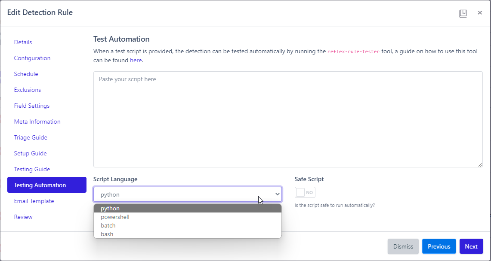

# Testing Automation
When configuring Detections, this newly added feature allows you to automatically test your Detection Rules without having to trigger it yourself. Choose from the following scripting languages to use as a test script:

* Python
* PowerShell
* Batch
* Bash

Rather than attempting to trigger a Detection on your own, an [Agent](../agents/index.md) will do it for you.

[ put a descriptive example here ]

