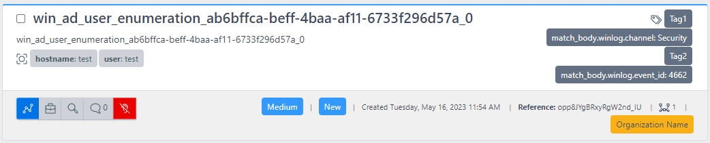

# Events
**Events** in ReflexSOAR are anything you want to act on in the Event Queue. Events do not have to strictly be security related; they could be network-related alerts, such as Orion/WhatsUpGold alerts.

Events serve as the primary action item for [Analysts and Users](../users/index.md) of ReflexSOAR and will appear in the Event Queue as a card (as seen below).



## Event Signatures
Event Signatures are the mechanism that ReflexSOAR uses to "*roll up*" or "*deduplicate*" similar events. By default, when using the ReflexSOAR [Agent](../agents/index.md), the Agent will compute the signature for the Event.

If you are using the API directly without an Agent, you will need to supply the signature logic yourself. Event Signatures use the following psuedo logic for computation:

```
md5(str(event_title, ...signature_fields))
```

!!! note "No Signature Provided"
    If no signature is provided the API will use the following logic to compute a signature
    ```
    md5(event_title+iso8601_date_string)
    ```

## Event States
Events can exist in four different states to signal where analysts are at in the triage process:

- **New** - default state for all new events (unless acted on by an [Event Rule](../event-rules/index.md) that overrides this status)
- **Dismissed** - state an event goes to when it has been automatically or manually dismissed
- **Open** - signals that the event has been added to a case and it awaiting client input/review
- **Closed** - signals the Event was worked in a case that has now been closed

## Event Processing
See [Event Processing](processing.md) for how Events are processed in Reflex.
